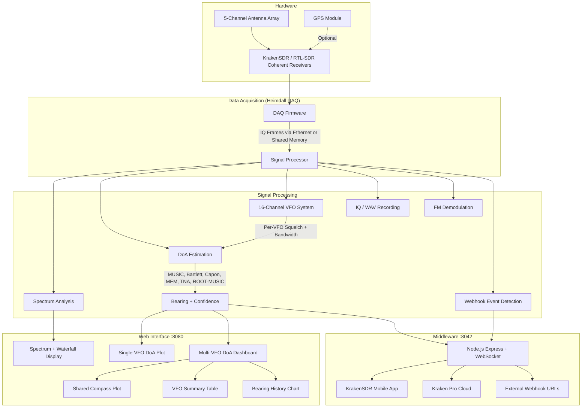
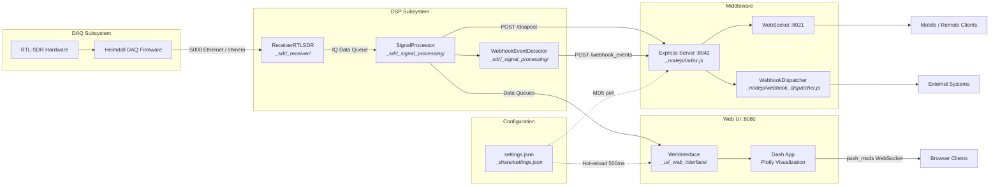
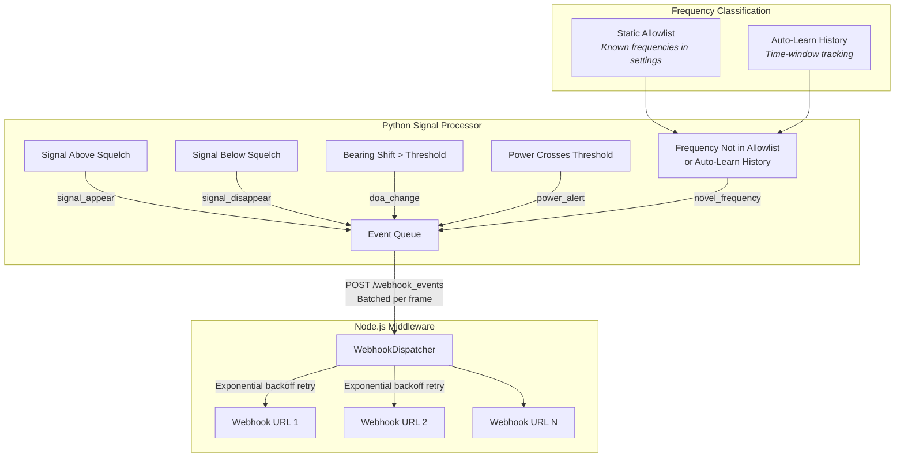
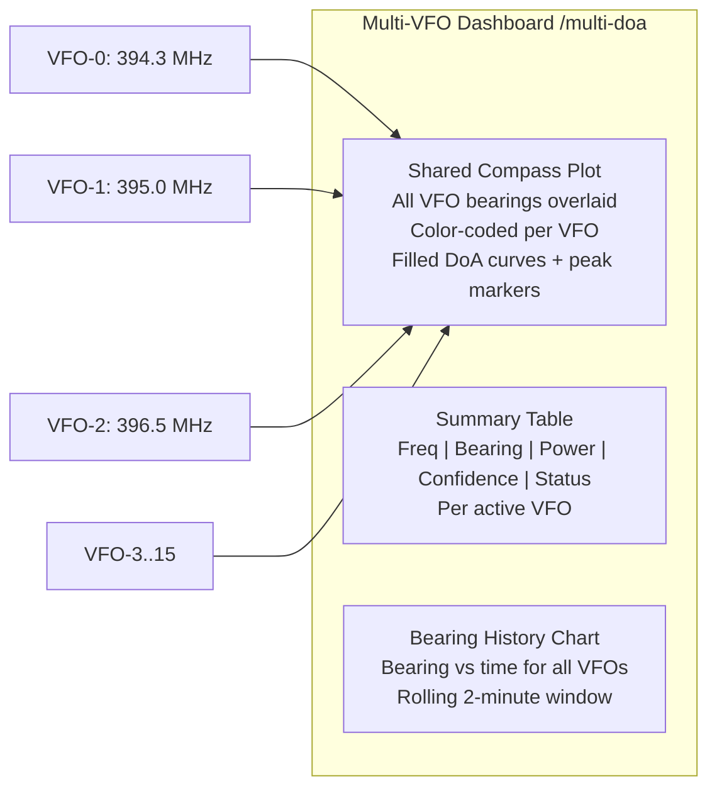

# KrakenSDR DoA DSP

Direction of arrival (DoA) estimation software for the KrakenSDR and other RTL-SDR based coherent receiver systems using the Heimdall DAQ Firmware.

## System Capabilities



## Architecture

The system comprises two main subsystems that can run locally (shared memory) or remotely (Ethernet):



## Webhook Event System

Configurable callbacks fire on signal events and dispatch to external URLs:



**Webhook event payload fields:** `event_type`, `timestamp`, `vfo_index`, `frequency_hz`, `station_id`, `latitude`, `longitude`, `bearing_deg`, `confidence`, `power_dbm`, `snr_db`, plus event-specific context fields.

## Multi-VFO DoA Dashboard

The Multi-VFO DoA page (`/multi-doa`) displays all active VFOs simultaneously:



**Requirement:** Set `output_vfo` to `-1` (ALL mode) so that DoA is computed for every active VFO.

## Network Ports

| Port | Service | Protocol |
|------|---------|----------|
| 5000 | DAQ data interface | Ethernet |
| 5001 | DAQ command interface | Ethernet |
| 8021 | WebSocket (real-time data to apps) | WS |
| 8042 | Middleware REST API (settings, DoA data, webhooks) | HTTP |
| 8080 | Web UI (Dash) | HTTP |
| 8081 | File server (settings.json, logs) | HTTP |

## Full Instructions

Please [consult the Wiki on the kraken_docs repo](https://github.com/krakenrf/krakensdr_docs/wiki) for full documentation on the use of the KrakenSDR.

## Raspberry Pi 4/5 and Orange Pi 5B Image QUICKSTART

**Download Latest Images From :** https://www.dropbox.com/scl/fo/uf6uosh31syxwt8m32pl4/ANeDj_epfa_PRliPPqCDSoU?rlkey=ovo459p6aiwio785d0h56lj7h&e=1&dl=0

**Alternative Download:** https://drive.google.com/drive/folders/14NuCOGM1Fh1QypDNMngXEepKYRBsG--B?usp=sharing

In these image the code will automatically run on boot. Note that it may take 2-3 minutes for the boot process to complete.

To run this code flash the image file to an SD Card using Etcher. The SD Card needs to be at least 8GB and we recommend using a class 10 card or faster. For advanced users the login/password details for SSH and terminal are "krakenrf"/"krakensdr"

Note that for the Orange Pi 5B, the image is for the Orange Pi 5**B** specifically. This is the Orange Pi 5 model with the included WiFi module.

Please follow the rest of the guide at https://github.com/krakenrf/krakensdr_docs/wiki/02.-Direction-Finding-Quickstart-Guide

### Pi 4 Overclock
To get the best performance we recommend adding aftermarket cooling to your Pi 4 and overclocking to at least 2000 MHz. We won't provide instructions for overclocking here, but they can be easily Googled.

### KerberosSDR Setup (KrakenSDR users Ignore)

Consult the Wiki page at https://github.com/krakenrf/krakensdr_docs/wiki/10.-KerberosSDR-Setup-for-KrakenSDR-Software for information on setting up your KerberosSDR to work with the KrakenSDR software.

## Software Quick Start

1) The code will automatically begin processing on boot, please wait for it to start. If started the "Frame Index" will be incrementing.
2) Enter your desired center frequency and click on "Update Receiver Parameters" to tune and calibrate on that frequency.
3) Enter your antenna array configuration details in the "DoA Configuration" card.
4) Set the VFO-0 bandwidth to the bandwidth of your signal.
5) Open the "Spectrum" button and ensure that your signal of interest is active and selected by the VFO-0 window. If it is a bursty signal, determine an appropriate squelching power, and enter it back into the VFO-0 squelch settings in the confuration screen.
6) Open the DOA Estimation tab to see DOA info.
7) Open the Multi-VFO DoA tab to see all VFO bearings simultaneously (requires output_vfo set to ALL).
8) Connect to the Android App for map visualization (See Android Instructions - coming later)

You can also 'click to tune' in the spectrum. Either by clicking on the spectrum graph or the waterfall at the frequency of interest.

## Webhook Configuration

Enable webhooks in the Configuration page under the "Webhook Configuration" card:

1. Check **Enable Webhooks** and enter one or more comma-separated webhook URLs.
2. Toggle which event types to receive: Signal Appear, Signal Disappear, Novel Frequency, DoA Change, Power Alert.
3. Set thresholds: DoA change degrees, power high/low dBm levels.
4. Configure frequency classification: enter known frequencies (Hz, comma-separated), set match tolerance, and optionally enable auto-learning with a time window.

Webhook events are POSTed as JSON to each configured URL with exponential backoff retry on failure. Monitor dispatch status at `GET http://KRAKEN_IP:8042/webhook_status`.

## VirtualBox Image
If you do not wish to use a Pi 4 as your KrakenSDR computing device, you can also use a Windows or Linux Laptop/PC with our VirtualBox pre-made image. This image file is currently in beta. It includes the KrakenSDR DOA, Passive Radar, and GNU Radio software.

See our Wiki for more information about our VirtualBox Image and where to download it https://github.com/krakenrf/krakensdr_docs/wiki/09.-VirtualBox,-Docker-Images-and-Install-Scripts#virtualbox

## Docker Image

See our Wiki for more information about the third party Docker image https://github.com/krakenrf/krakensdr_docs/wiki/09.-VirtualBox,-Docker-Images-and-Install-Scripts#docker

## Manual Installation from a fresh OS

### Install script

You can use on of our install scripts to automate a manual install. Details on the Wiki at https://github.com/krakenrf/krakensdr_docs/wiki/09.-VirtualBox,-Docker-Images-and-Install-Scripts#install-scripts

###  Manual Install

Manual install is only required if you are not using the premade images, and are setting up the software from a clean system.

1. Install the prerequisites

``` bash
sudo apt -y update
sudo apt -y install nodejs jq rustc cargo php-cli
cargo install miniserve
```

(**OPTIONAL** - rustc, cargo and miniserver are not needed for 99% of users, and we don't recommend installing unless you know what you're doing)

(NOTE: If installing miniserve you might need to get the latest rustc directly from Rust depending on your OS - see Issue https://github.com/krakenrf/krakensdr_doa/issues/131)
```bash
sudo apt -y install rustc cargo
cargo install miniserve
```

2. Install Heimdall DAQ

If not done already, first, follow the instructions at https://github.com/krakenrf/heimdall_daq_fw/tree/main to install the Heimdall DAQ Firmware.

3. Set up Miniconda environment

You will have created a Miniconda environment during the Heimdall DAQ install phase.

Please run the installs in this order as we need to ensure a specific version of dash and Werkzeug is installed because newer versions break compatibility with other libraries.

``` bash
conda activate kraken

conda install pandas
conda install orjson
conda install matplotlib
conda install requests

pip3 install dash_bootstrap_components==1.1.0
pip3 install quart_compress==0.2.1
pip3 install quart==0.17.0
pip3 install dash_devices==0.1.3
pip3 install pyargus

conda install dash==1.20.0
conda install werkzeug==2.0.2
conda install -y plotly==5.23.0
```

4. (**OPTIONAL**) Install GPSD if you want to run a USB GPS on the Pi 4.

```
sudo apt install gpsd
pip3 install gpsd-py3
```

5. Install the `krakensdr_doa` software

```bash
cd ~/krakensdr
git clone https://github.com/krakenrf/krakensdr_doa
```

Copy the the `krakensdr_doa/util/kraken_doa_start.sh` and the `krakensdr_doa/util/kraken_doa_stop.sh` scripts into the krakensdr root folder of the project.
```bash
cp krakensdr_doa/util/kraken_doa_start.sh .
cp krakensdr_doa/util/kraken_doa_stop.sh .
```

## Running

### Local operation (Recommended)

```bash
./kraken_doa_start.sh
```

Please be patient on the first run, as it can take 1-2 minutes for the JIT numba compiler to compile the numba optimized functions (on Pi 4 hardware), and during this compilation time it may appear that the software has gotten stuck. On subsqeuent runs this loading time will be much faster as it will read from cache.

### Remote operation

With remote operation you can run the DAQ on one machine on your network, and the DSP software on another.

1. Start the heimdall DAQ subsystem on your remote computing device. (Make sure that the `daq_chain_config.ini` contains the proper configuration)
    (See:https://github.com/krakenrf/heimdall_daq_fw/blob/main/Documentation/HDAQ_firmware_ver1.0.20201130.pdf)
2. Set the IP address of the DAQ Subsystem in the `settings.json`, `default_ip` field.
3. Start the DoA DSP software by typing:
`./gui_run.sh`
4. To stop the server and the DSP processing chain run the following script:
`./kill.sh`

After starting the script a web based server opens at port number `8080`, which then can be accessed by typing `KRAKEN_IP:8080/` in the address bar of any web browser. You can find the IP address of the KrakenSDR Pi4 wither via your routers WiFi management page, or by typing `ip addr` into the terminal. You can also use the hostname of the Pi4 in place of the IP address, but this only works on local networks, and not the internet, or mobile hotspot networks.


### Remote control

The `settings.json` file that contains most of the DoA DSP settings is served via HTTP and can be accessed via `http://KRAKEN_IP:8081/settings.json`. Not only the client can download it on the remote machine, but also upload `settings.json` to the host that runs DSP software via, e.g.,

```bash
curl -F "path=@settings.json" http://KRAKEN_IP:8081/upload\?path\=/
```

The DSP software would then notice the settings changes and apply them automatically.

#### Alternative via middleware

You can also use the middleware API to retrive and change the settings.json, the api is avaliable under `http://KRAKEN_IP:8042/settings` and works without enabling the remote mode mentioned in the software startup.

Use a simple GET request to the endpoint to retrive the current settings in json format.
To set a new settings file just send the json data as a POST request to the endpoint.

A typical use would be the following:

* GET request - retrive current settings
* modify settings in json
* POST request - save new settings to kraken

### Middleware API Endpoints

| Method | Endpoint | Description |
|--------|----------|-------------|
| GET | `/settings` | Retrieve current settings.json |
| POST | `/settings` | Update settings.json (triggers hot-reload) |
| POST | `/doapost` | Receive DoA results from signal processor |
| POST | `/webhook_events` | Receive batched signal events from Python for webhook dispatch |
| GET | `/webhook_status` | Retrieve webhook dispatch statistics |


## For Contributors

If you plan to contribute code then it must follow certain formatting style. The easiest way to apply autoformatting and check for any [PEP8](https://peps.python.org/pep-0008/) violations is to install [`pre-commit`](https://pre-commit.com/) tool, e.g., with

```bash
pip3 install --user pre-commit
```

Then from within the `krakensdr_doa` folder execute:

```bash
pre-commit install
```

that would set up git pre-commit hooks. Those will autoformat and check changed files on every consecutive commits. Once you create PR for your changes, [GitHub Actions](https://github.com/features/actions) will be executed to perform the very same checks as the hooks to make sure your code follows the formatting style and does not violate PEP8 rules.

## Upcoming Features and Known Bugs

1. [FEATURE] It would be better if the KrakenSDR controls, spectrum and/or DOA graphs could be accessible from the same page. Future work will look to integrate the controls in a sidebar.

2. [FEATURE] Wideband scanning. There should be a feature to rapidly scan through a set of frequencies over a wide bandwidth, and perform DFing on a signal in that set if it is active. To do this a rapid scan feature that does not do coherent calibration needs to be implemented first. Then when an active signal is found, calibrate as fast as possible, and do the DoA calculation on that signal for a set period of time, before returning to scan mode.

## Array Sizing Calculator and Templates

Please find the array sizing calculator at https://docs.google.com/spreadsheets/d/1w_LoJka7n38-F0a3vgaTVcSXxjXvH2Td/edit?usp=sharing&ouid=113401145893186461043&rtpof=true&sd=true. Download this file and use it in Excel.

For our own KrakenSDR branded magnetic whip antenna sets we have a paper printable array template for UCA radius spacings every 50mm linked below. Print 5 arms and one middle and cut out the template and holes so that the antenna base fits inside them. Then use a glue stick to glue the arms onto the base.

**Array Arms:** https://drive.google.com/file/d/16tjBljRIHRUfqSs5Vb5xsypVTtHK_vDl/view?usp=sharing

**Array Middle Pentagon:** https://drive.google.com/file/d/1ekBcr3fQEz1d8WlKEerOmj-JriCywHhg/view?usp=sharing

You can also 3D print a more rigid template:

**Array Arm:** https://drive.google.com/file/d/1LsiqZolMU4og2NStPewQWhIh3z6N1zb5/view?usp=sharing

**Array Middle Pentagon:** https://drive.google.com/file/d/1fn4KO7orITNJWV99XJHYu8RlZgmTl6-5/view?usp=sharing
